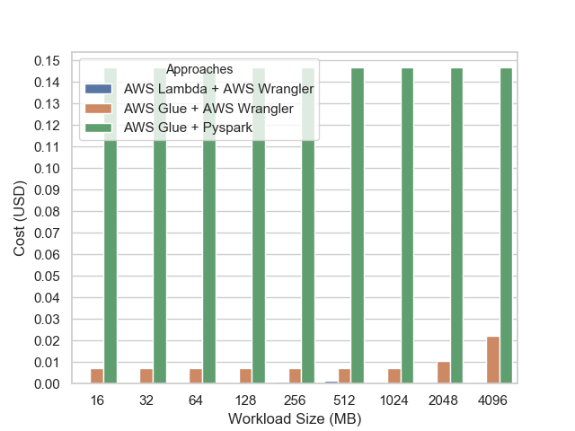
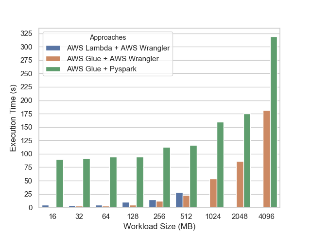
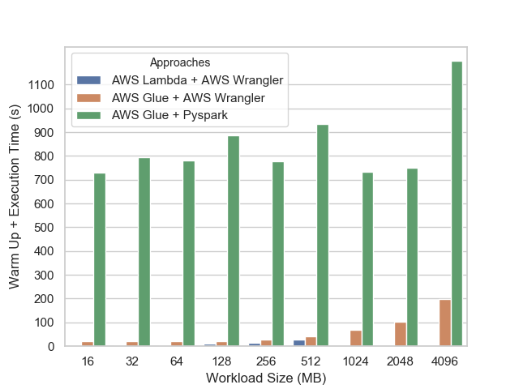

.. _doc_benchmarks:

Serverless Benchmark
====================

**AWS Data Wrangler** and **Apache Spark** can be used to execute data transformations, but they have different targets.

Spark already has a good sinergy with the AWS ecosystem, but is focused on big data workloads and brings unnecessary overhead and complexity for "small" data.

AWS Wrangler aims to fill this gap and help to move small data through the AWS ecosystem with efficiency simplicity.

So this uncompromised orange and apple comparision is only to demonstrate that there are a right tool for each job.

Methodology
-----------

We will compare three different ETL **serverless** approaches.

- AWS Glue + Pyspark (2 DPU, minimal configuration)
- AWS Glue + AWS Wrangler (1 DPU, maximum configuration)
- AWS Lambda + AWS Wrangler (3 GB of RAM, maximum configuration)

The tested ETL consist in read a aleatory generated CSV file (With sizes between 16 to 4096 MB) in S3 and then write it back as partitioned Parquet.

`SOURCE <https://github.com/awslabs/aws-data-wrangler/tree/master/benchmarks/serverless_etl>`_

*P.S: The AWS Lambda approach can't handle the workloads bigger than 700 MB.*

Metrics
-------

    Cost (Less is better)

    *P.S: The AWS Lambda approach can't handle the workloads bigger than 700 MB.*

    Execution Time (Less is better)

    *P.S: The AWS Lambda approach can't handle the workloads bigger than 700 MB.*

    Warm Up + Execution Time (Less is better)

    *P.S: The AWS Lambda approach can't handle the workloads bigger than 700 MB.*

Conclusion
----------

- As long as your data fits in memory, you should use AWS Wrangler
- If your data doesn't fit in memory, you should use Apache Spark
