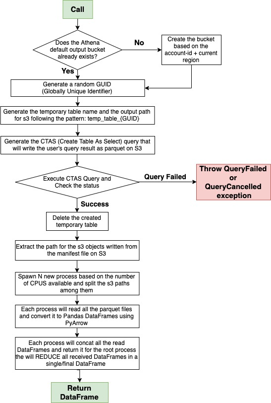
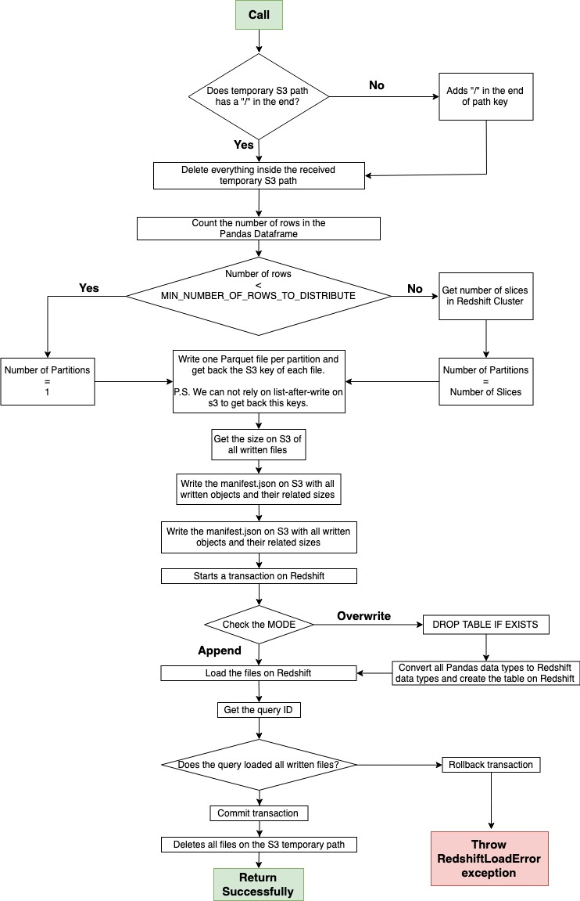

.. _doc_divingdeep:

Diving Deep
===========

Parallelism, Non-picklable objects and GeoPandas
------------------------------------------------

AWS Data Wrangler tries to parallelize everything that is possible (I/O and CPU bound task).
You can control the parallelism level using the parameters:

- procs_cpu_bound: number of processes that can be used in single node applications for CPU bound case (Default: os.cpu_count())
- procs_io_bound: number of processes that can be used in single node applications for I/O bound cases (Default: os.cpu_count() * PROCS_IO_BOUND_FACTOR)

Both can be defined on Session level or directly in the functions.

Some special cases will not work with parallelism:

- GeoPandas
- Columns with non-picklable objects

To handle that use `procs_cpu_bound=1` and avoid the distribution of the dataframe.

Pandas with null object columns (UndetectedType exception)
----------------------------------------------------------

Pandas has a too generic "data type" named object. Pandas object columns can be string, dates, etc, etc, etc.
We can handle this object column fine inferring the types of theses objects inside the values, Pyarrow does that like a charm. So the real problem starts when we have a completely null object column because we don't have anything to infer.

To work with null object columns you can explicitly set the expected Athena data type for the target table doing:

.. code-block:: python

    import awswrangler
    import pandas as pd

    dataframe = pd.DataFrame({
        "col": [1, 2],
        "col_string_null": [None, None],
        "col_date_null": [None, None],
    })
    session = awswrangler.Session()
    session.pandas.to_parquet(
        dataframe=dataframe,
        database="DATABASE",
        path=f"s3://...",
        cast_columns={
          "col_string_null": "string",
          "col_date_null": "date"
        })

Athena to Pandas Flow (PARALLEL/CTAS)
-------------------------------------

    Athena to Pandas Flow (PARALLEL/CTAS)

Pandas to Redshift Flow
-----------------------

    Pandas to Redshift Flow

Spark to Redshift Flow
----------------------

.. figure:: _static/spark-to-redshift-flow.jpg
    :align: center
    :alt: alternate text
    :figclass: align-center

    Spark to Redshift Flow
