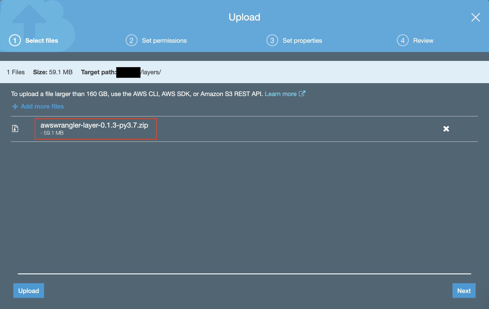
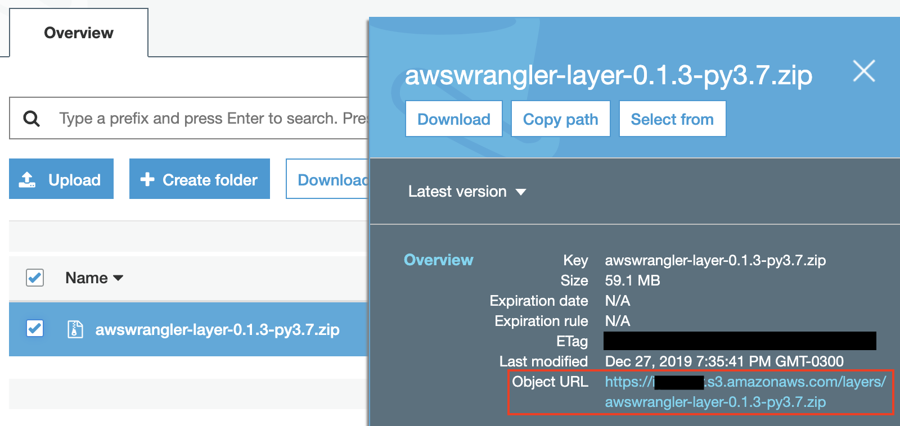
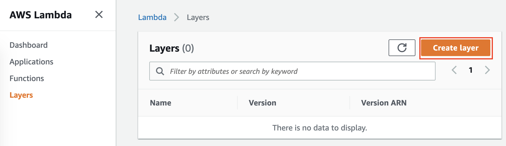
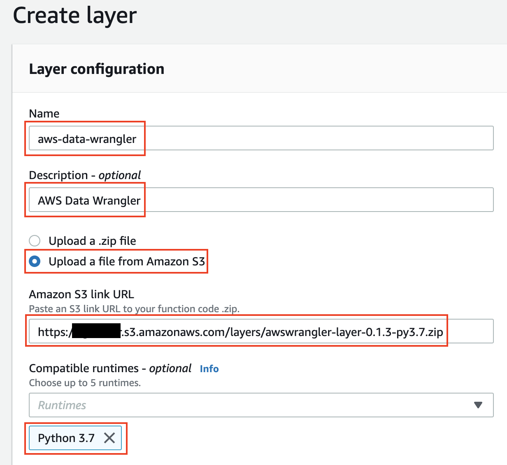
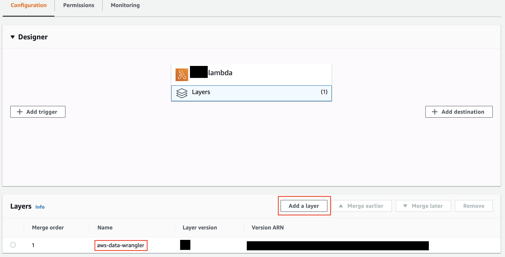

Install
============

    >>> pip install awswrangler

    >>> conda install -c conda-forge awswrangler

Runs with Python 3.6, 3.7 and 3.8.

Runs anywhere (AWS Lambda, AWS Glue Python Shell, EMR, EC2, on-premises, local, etc).

.. note:: Lambda Layer's bundle and Glue's wheel/egg are available to `download <https://github.com/awslabs/aws-data-wrangler/releases>`_. Just upload it and run! 🚀
.. note:: Have you never used Layers? Check the :ref:`step-by-step guide <Setting Up Lambda Layer>`.
.. note:: AWS Data Wrangler counts with compiled dependencies (C/C++) so there is no support for Glue PySpark by now.
.. note:: PySpark doesn't support Python 3.8 yet.

Setting Up Lambda Layer
-----------------------

.. figure:: _static/step-by-step/lambda-layer/download.png
    :align: center
    :alt: alternate text
    :figclass: align-center

    Go to `GitHub's release section <https://github.com/awslabs/aws-data-wrangler/releases>`_ and download the layer bundle related to the desired version. Also select between Python 3.6, 3.7 and 3.8.

    Go to the AWS console and open the S3 panel. Upload the layer bundle to any S3 bucket in the desired AWS region.

    Copy the S3 object URL.

    Go to the AWS Lambda Panel, get in the layer's section (left side) and click to create one.

    Fill the fields (Use the pasted URL) and create your layer.

    Go to your AWS Lambda and use it!
