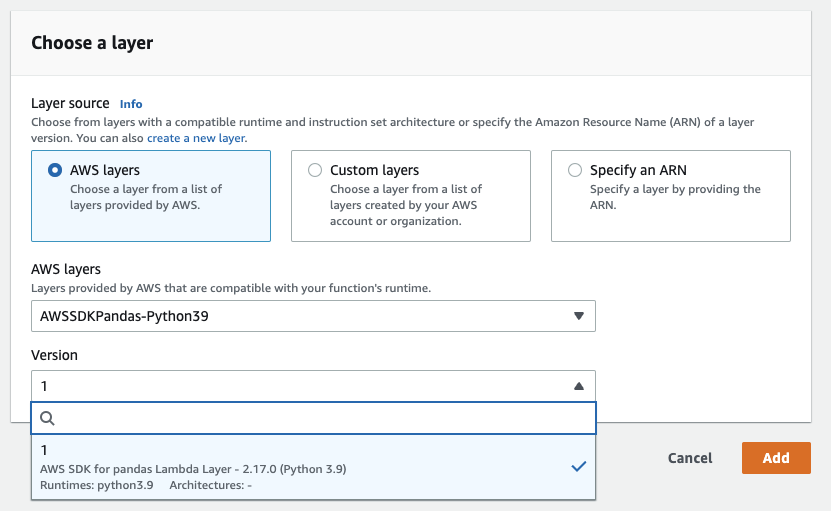

Install
=======

**AWS SDK for pandas** runs on Python ``3.8``, ``3.9``, ``3.10`` and ``3.11``,
and on several platforms (AWS Lambda, AWS Glue Python Shell, EMR, EC2,
on-premises, Amazon SageMaker, local, etc).

Some good practices to follow for options below are:

- Use new and isolated Virtual Environments for each project (`venv <https://docs.python.org/3/library/venv.html>`_).
- On Notebooks, always restart your kernel after installations.

PyPI (pip)
----------

    >>> pip install awswrangler

    >>> # Optional modules are installed with:
    >>> pip install 'awswrangler[redshift]'

Conda
-----

    >>> conda install -c conda-forge awswrangler

At scale
---------

AWS SDK for pandas can also run your workflows at scale by leveraging `modin <https://modin.readthedocs.io/en/stable/>`_ and `ray <https://www.ray.io/>`_.

    >>> pip install "awswrangler[modin,ray]"

As a result existing scripts can run on significantly larger datasets with no code rewrite.

Optional dependencies
---------------------

Starting version 3.0, some ``awswrangler`` modules are optional and must be installed explicitly using:

    >>> pip install 'awswrangler[optional-module1, optional-module2]'

The optional modules are:

- redshift
- mysql
- postgres
- sqlserver
- oracle
- gremlin
- sparql
- opencypher
- openpyxl
- opensearch
- deltalake

Calling these modules without the required dependencies raises an error prompting you to install the missing package.

AWS Lambda Layer
----------------

Managed Layer
^^^^^^^^^^^^^^

.. note:: There is a one week minimum delay between version release and layers being available in the AWS Lambda console.
.. warning::
    Lambda Functions using the layer with a memory size of less than 512MB may be insufficient for some workloads.

AWS SDK for pandas is available as an AWS Lambda Managed layer in all AWS commercial regions.

It can be accessed in the AWS Lambda console directly:

Or via its ARN: ``arn:aws:lambda:<region>:336392948345:layer:AWSSDKPandas-Python<python-version>:<layer-version>``.

For example: ``arn:aws:lambda:us-east-1:336392948345:layer:AWSSDKPandas-Python38:1``.

The full list of ARNs is available `here <layers.rst>`__.

Custom Layer
^^^^^^^^^^^^^^

You can also create your own Lambda layer with these instructions:

1 - Go to `GitHub's release section <https://github.com/aws/aws-sdk-pandas/releases>`_
and download the zipped layer for to the desired version. Alternatively, you can download the zip from the `public artifacts bucket <https://aws-sdk-pandas.readthedocs.io/en/latest/install.html#public-artifacts>`_.

2 - Go to the AWS Lambda console, open the layer section (left side)
and click **create layer**.

3 - Set name and python version, upload your downloaded zip file
and press **create**.

4 - Go to your Lambda function and select your new layer!

Serverless Application Repository (SAR)
^^^^^^^^^^^^^^^^^^^^^^^^^^^^^^^^^^^^^^^^

AWS SDK for pandas layers are also available in the `AWS Serverless Application Repository <https://serverlessrepo.aws.amazon.com/applications>`_ (SAR).

The app deploys the Lambda layer version in your own AWS account and region via a CloudFormation stack.
This option provides the ability to use semantic versions (i.e. library version) instead of Lambda layer versions.

.. list-table:: AWS SDK for pandas Layer Apps
   :widths: 25 25 50
   :header-rows: 1

   * - App
     - ARN
     - Description
   * - aws-sdk-pandas-layer-py3-8
     - arn:aws:serverlessrepo:us-east-1:336392948345:applications/aws-sdk-pandas-layer-py3-8
     - Layer for ``Python 3.8.x`` runtimes
   * - aws-sdk-pandas-layer-py3-9
     - arn:aws:serverlessrepo:us-east-1:336392948345:applications/aws-sdk-pandas-layer-py3-9
     - Layer for ``Python 3.9.x`` runtimes
   * - aws-sdk-pandas-layer-py3-10
     - arn:aws:serverlessrepo:us-east-1:336392948345:applications/aws-sdk-pandas-layer-py3-10
     - Layer for ``Python 3.10.x`` runtimes
   * - aws-sdk-pandas-layer-py3-11
     - arn:aws:serverlessrepo:us-east-1:336392948345:applications/aws-sdk-pandas-layer-py3-11
     - Layer for ``Python 3.11.x`` runtimes

Here is an example of how to create and use the AWS SDK for pandas Lambda layer in your CDK app:

.. code-block:: python

    from aws_cdk import core, aws_sam as sam, aws_lambda

    class AWSSDKPandasApp(core.Construct):
      def __init__(self, scope: core.Construct, id_: str):
        super.__init__(scope,id)

        aws_sdk_pandas_layer = sam.CfnApplication(
          self,
          "awssdkpandas-layer",
          location=sam.CfnApplication.ApplicationLocationProperty(
            application_id="arn:aws:serverlessrepo:us-east-1:336392948345:applications/aws-sdk-pandas-layer-py3-8",
            semantic_version="3.0.0",  # Get the latest version from https://serverlessrepo.aws.amazon.com/applications
          ),
        )

        aws_sdk_pandas_layer_arn = aws_sdk_pandas_layer.get_att("Outputs.WranglerLayer38Arn").to_string()
        aws_sdk_pandas_layer_version = aws_lambda.LayerVersion.from_layer_version_arn(self, "awssdkpandas-layer-version", aws_sdk_pandas_layer_arn)

        aws_lambda.Function(
          self,
          "awssdkpandas-function",
          runtime=aws_lambda.Runtime.PYTHON_3_8,
          function_name="sample-awssdk-pandas-lambda-function",
          code=aws_lambda.Code.from_asset("./src/awssdk-pandas-lambda"),
          handler='lambda_function.lambda_handler',
          layers=[aws_sdk_pandas_layer_version]
        )

AWS Glue Python Shell Jobs
--------------------------

.. note:: Glue Python Shell Python3.9 has version 2.15.1 of awswrangler `baked in <https://aws.amazon.com/blogs/big-data/aws-glue-python-shell-now-supports-python-3-9-with-a-flexible-pre-loaded-environment-and-support-to-install-additional-libraries/>`_. If you need a different version, follow instructions below:

1 - Go to `GitHub's release page <https://github.com/aws/aws-sdk-pandas/releases>`_ and download the wheel file
(.whl) related to the desired version. Alternatively, you can download the wheel from the `public artifacts bucket <https://aws-sdk-pandas.readthedocs.io/en/latest/install.html#public-artifacts>`_.

2 - Upload the wheel file to the Amazon S3 location of your choice.

3 - Go to your Glue Python Shell job and point to the S3 wheel file in
the *Python library path* field.

`Official Glue Python Shell Reference <https://docs.aws.amazon.com/glue/latest/dg/add-job-python.html#create-python-extra-library>`_

AWS Glue for Ray Jobs
----------------------

Go to your Glue for Ray job and create a new *Job parameters* key/value:

* Key: ``--pip-install``
* Value: ``awswrangler[modin]``

`Official Glue for Ray Reference <https://docs.aws.amazon.com/glue/latest/dg/author-job-ray-python-libraries.html>`_

AWS Glue PySpark Jobs
---------------------

.. note:: AWS SDK for pandas has compiled dependencies (C/C++) so support is only available for ``Glue PySpark Jobs >= 2.0``.

Go to your Glue PySpark job and create a new *Job parameters* key/value:

* Key: ``--additional-python-modules``
* Value: ``pyarrow==7,awswrangler``

To install a specific version, set the value for the above Job parameter as follows:

* Value: ``pyarrow==7,pandas==1.5.3,awswrangler==3.4.0``

`Official Glue PySpark Reference <https://docs.aws.amazon.com/glue/latest/dg/reduced-start-times-spark-etl-jobs.html#reduced-start-times-new-features>`_

Public Artifacts
-----------------

Lambda zipped layers and Python wheels are stored in a publicly accessible S3 bucket for all versions.

* Bucket: ``aws-data-wrangler-public-artifacts``

* Prefix: ``releases/<version>/``

  * Lambda layer: ``awswrangler-layer-<version>-py<py-version>.zip``

  * Python wheel: ``awswrangler-<version>-py3-none-any.whl``

For example: ``s3://aws-data-wrangler-public-artifacts/releases/3.0.0/awswrangler-layer-3.0.0-py3.8.zip``

You can check the bucket to find the latest version.

Amazon SageMaker Notebook
-------------------------

Run this command in any Python 3 notebook cell and then make sure to
**restart the kernel** before importing the **awswrangler** package.

    >>> !pip install awswrangler

Amazon SageMaker Notebook Lifecycle
-----------------------------------

Open the AWS SageMaker console, go to the lifecycle section and
use the below snippet to configure AWS SDK for pandas for all compatible
SageMaker kernels (`Reference <https://github.com/aws-samples/amazon-sagemaker-notebook-instance-lifecycle-config-samples/blob/master/scripts/install-pip-package-all-environments/on-start.sh>`_).

.. code-block:: sh

    #!/bin/bash

    set -e

    # OVERVIEW
    # This script installs a single pip package in all SageMaker conda environments, apart from the JupyterSystemEnv which
    # is a system environment reserved for Jupyter.
    # Note this may timeout if the package installations in all environments take longer than 5 mins, consider using
    # "nohup" to run this as a background process in that case.

    sudo -u ec2-user -i <<'EOF'

    # PARAMETERS
    PACKAGE=awswrangler

    # Note that "base" is special environment name, include it there as well.
    for env in base /home/ec2-user/anaconda3/envs/*; do
        source /home/ec2-user/anaconda3/bin/activate $(basename "$env")
        if [ $env = 'JupyterSystemEnv' ]; then
            continue
        fi
        nohup pip install --upgrade "$PACKAGE" &
        source /home/ec2-user/anaconda3/bin/deactivate
    done
    EOF

EMR Cluster
-----------

Despite not being a distributed library, AWS SDK for pandas could be used to complement Big Data pipelines.

- Configure Python 3 as the default interpreter for
  PySpark on your cluster configuration [ONLY REQUIRED FOR EMR < 6]

    .. code-block:: json

        [
          {
             "Classification": "spark-env",
             "Configurations": [
               {
                 "Classification": "export",
                 "Properties": {
                    "PYSPARK_PYTHON": "/usr/bin/python3"
                  }
               }
            ]
          }
        ]

- Keep the bootstrap script above on S3 and reference it on your cluster.

  - For EMR Release < 6

    .. code-block:: sh

        #!/usr/bin/env bash
        set -ex

        sudo pip-3.6 install pyarrow==2 awswrangler

  - For EMR Release >= 6

    .. code-block:: sh

        #!/usr/bin/env bash
        set -ex

        sudo pip install awswrangler

From Source
-----------

    >>> git clone https://github.com/aws/aws-sdk-pandas.git
    >>> cd aws-sdk-pandas
    >>> pip install .

Notes for Microsoft SQL Server
------------------------------

``awswrangler`` uses `pyodbc <https://github.com/mkleehammer/pyodbc>`_
for interacting with Microsoft SQL Server. To install this package you need the ODBC header files,
which can be installed, with the following commands:

    >>> sudo apt install unixodbc-dev
    >>> yum install unixODBC-devel

After installing these header files you can either just install ``pyodbc`` or
``awswrangler`` with the ``sqlserver`` extra, which will also install ``pyodbc``:

    >>> pip install pyodbc
    >>> pip install 'awswrangler[sqlserver]'

Finally you also need the correct ODBC Driver for SQL Server. You can have a look at the
`documentation from Microsoft <https://docs.microsoft.com/sql/connect/odbc/
microsoft-odbc-driver-for-sql-server?view=sql-server-ver15>`_
to see how they can be installed in your environment.

If you want to connect to Microsoft SQL Server from AWS Lambda, you can build a separate Layer including the
needed OBDC drivers and `pyobdc`.

If you maintain your own environment, you need to take care of the above steps.
Because of this limitation usage in combination with Glue jobs is limited and you need to rely on the
provided `functionality inside Glue itself <https://docs.aws.amazon.com/glue/latest/dg/
aws-glue-programming-etl-connect.html#aws-glue-programming-etl-connect-jdbc>`_.

Notes for Oracle Database
------------------------------

``awswrangler`` is using the `oracledb <https://github.com/oracle/python-oracledb>`_
for interacting with Oracle Database. For installing this package you do not need the Oracle Client libraries
unless you want to use the Thick mode.
You can have a look at the `documentation from Oracle <https://cx-oracle.readthedocs.io/en/latest/user_guide/
installation.html#oracle-client-and-oracle-database-interoperability>`_
to see how they can be installed in your environment.

After installing these client libraries you can either just install ``oracledb`` or
``awswrangler`` with the ``oracle`` extra, which will also install ``oracledb``:

    >>> pip install oracledb
    >>> pip install 'awswrangler[oracle]'

If you maintain your own environment, you need to take care of the above steps.
Because of this limitation usage in combination with Glue jobs is limited and you need to rely on the
provided `functionality inside Glue itself <https://docs.aws.amazon.com/glue/latest/dg/
aws-glue-programming-etl-connect.html#aws-glue-programming-etl-connect-jdbc>`_.
