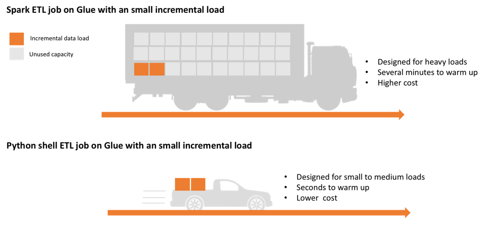

.. _doc_rationale:

Rationale
============

AWS Data Wrangler aims to fill a gap between AWS Analytics Services (Glue, Athena, EMR, Redshift) and the most popular Python libraries for **lightweight** workloads.

The rationale behind AWS Data Wrangler is to use the right tool for each job. And this project was developed with the lightweight jobs in mind. That is never so clear and depends of a lot of different factors, but a good rule of thumb that we discoverd during the tests is that if your workload is something around 5 GB in plan text or less, so you should go with AWS Data Wrangler instead of the consagrated big data tools.

Usually there are two different types of use cases when dealing with data, heavy workloads which are dealt better using distributed tools services like EMR/AWS Glue Spark Job and lightweight workloads that can be treated most efficient using simpler tools, and this is when aws data wrangler comes into action.

For example, in `AWS Glue <https://aws.amazon.com/glue/>`_ you can choose between two different types of Job, distributed with Apache Spark or single node with Python Shell. In this case data wrangler would use the single node with Python Shell job option (Or even AWS Lambda), resulting in less cost and less warm-up time.

    Rationale